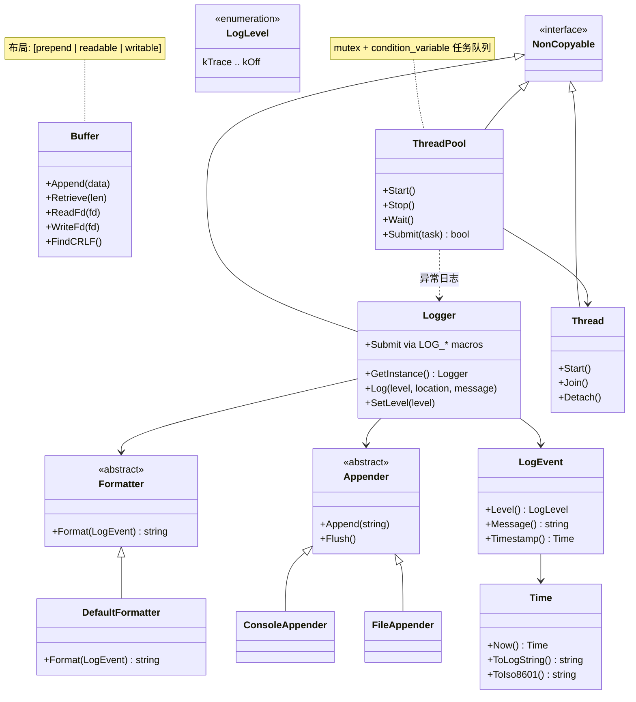

# SolarNet 架构设计

## 项目定位

SolarNet 是受 [muduo](https://github.com/chenshuo/muduo) 启发的现代 C++20 Linux 网络框架，作为 Solar 系列（云盘、RPC、任务调度、HTTP、AI Gateway）的底层基础设施。

设计目标：

- **长期可维护**：模块边界清晰、API 文档完整、测试覆盖充分
- **高性能**：零拷贝读取、readv/writev、线程池并发
- **现代 C++**：RAII、智能指针、`std::span` / `std::format` / `std::source_location`

## 阶段规划

| 阶段 | 范围 | 状态 |
| --- | --- | --- |
| Phase 0 | 工程基础设施（CMake、CI、clang-format/tidy） | ✅ 完成 |
| Phase 1 | 基础模块（Time、Logger、Buffer） | ✅ 完成 |
| Phase 2 | 并发原语（Thread、ThreadPool） | ✅ 完成 |
| Phase 3 | 网络核心（EventLoop、Channel） | 🚧 进行中 |

## 分层架构

```
┌─────────────────────────────────────────┐
│  应用层  examples/  tests/  benchmarks/ │
├─────────────────────────────────────────┤
│  网络层（Phase 3+） EventLoop / TcpConn  │
├─────────────────────────────────────────┤
│  并发层  Thread / ThreadPool             │
├─────────────────────────────────────────┤
│  基础层  Buffer / Logger / Time          │
├─────────────────────────────────────────┤
│  工具层  NonCopyable / Version           │
└─────────────────────────────────────────┘
```

## 模块职责

| 模块 | 路径 | 职责 |
| --- | --- | --- |
| `NonCopyable` | `solar_net/base/non_copyable.h` | 禁止拷贝、允许移动的基类 |
| `Time` | `solar_net/base/time.h` | 系统时间戳、格式化 |
| `Logger` | `solar_net/base/logger.h` | 分级日志、多 Appender、宏快捷写入 |
| `Buffer` | `solar_net/base/buffer.h` | 网络 I/O 字节缓冲区 |
| `Thread` | `solar_net/base/thread.h` | std::thread RAII 封装 |
| `ThreadPool` | `solar_net/base/thread_pool.h` | 固定大小任务线程池 |
| `Version` | `solar_net/version.h` | 版本信息 |

## 类图（Phase 0–2）



## 生命周期约定

### Thread

```
构造 → Start() → [运行回调] → Join()/Detach()
                              ↓
                         析构时自动 Join（若未 detach）
```

### ThreadPool

```
构造 → Start() → Submit(task)* → Stop() → Wait()
  ↓                                      ↓
析构时若未 Stop，自动 Stop + Wait
```

**注意**：仅调用 `Wait()` 而不调用 `Stop()` 会导致永久阻塞。

### Logger

```
GetInstance() → SetLevel / AddAppender / LOG_* → Flush()
```

进程级单例，默认 ConsoleAppender + Info 级别。

## API 稳定性策略

| 级别 | 说明 | 当前模块 |
| --- | --- | --- |
| **Stable** | Phase 内不再破坏性变更 | `Time`、`NonCopyable`、`Version` |
| **Beta** | 接口基本稳定，可能微调 | `Buffer`、`Logger`、`Thread`、`ThreadPool` |
| **Unstable** | Phase 3 尚未开始 | 网络层 API |

### 命名约定

- 命名空间：`solar_net`
- 类名：PascalCase（`ThreadPool`）
- 成员变量：`m_` 前缀（`m_reader_index`）
- 常量：`k` 前缀（`kInitialSize`）
- 头文件路径：`solar_net/base/<module>.h`

### 包含路径

所有公共头文件通过 `#include "solar_net/base/xxx.h"` 引用，CMake 将项目根目录设为 include 根。

## 依赖关系

```
ThreadPool → Thread, Logger
Logger     → Time, NonCopyable
Buffer     → （独立，仅标准库）
Thread     → NonCopyable, pthread
```

ThreadPool 捕获任务异常并通过 Logger 记录，避免 worker 线程因未捕获异常而终止。

## 后续演进

- **Buffer**：实现 `Shrink()`、可选内存池
- **Logger**：异步 Appender、日志轮转
- **ThreadPool**：任务返回值（future/promise）、优雅关闭超时
- **网络层**：Reactor 模型 EventLoop + epoll
