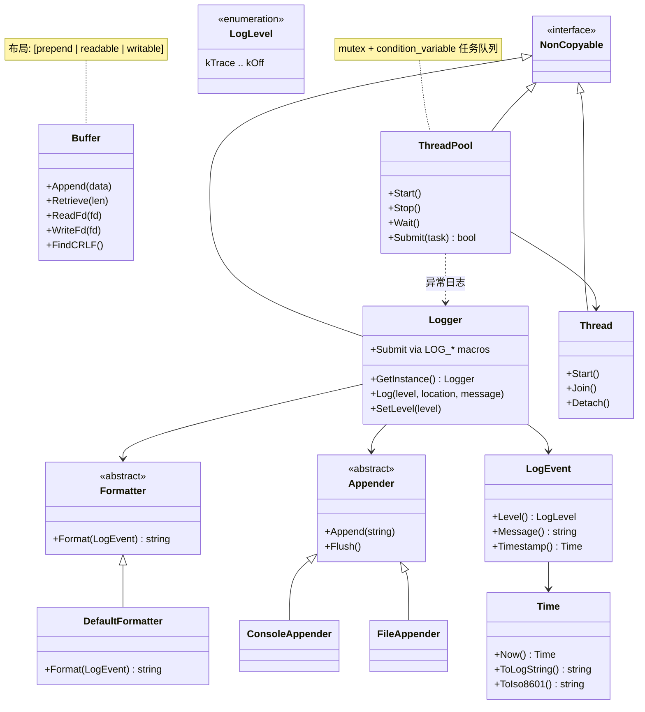
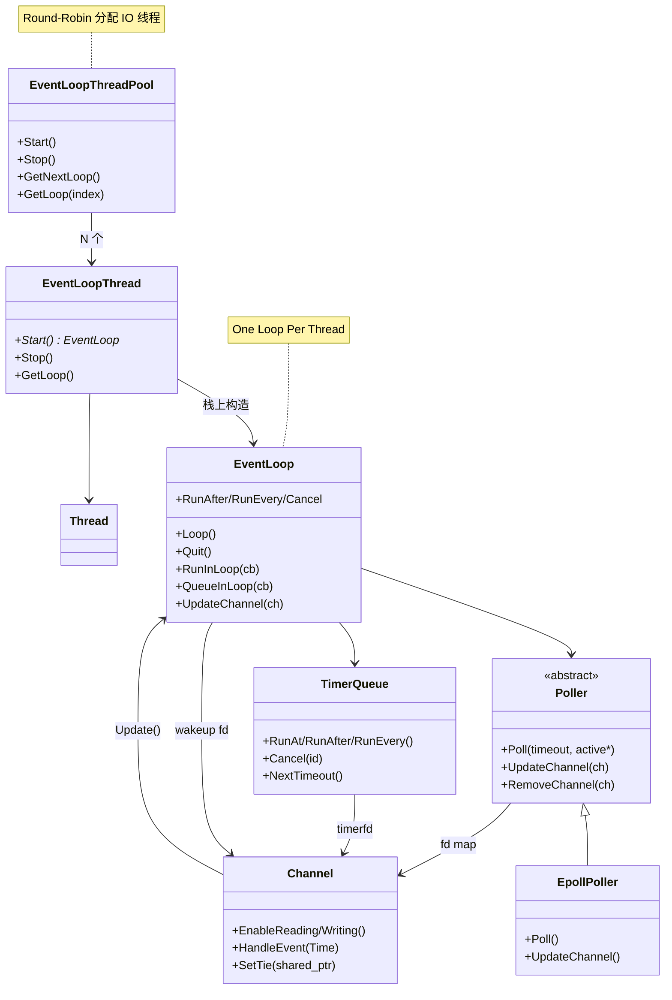

# SolarNet 架构设计

## 项目定位

SolarNet 是受 [muduo](https://github.com/chenshuo/muduo) 启发的现代 C++20 Linux 网络框架，作为 Solar 系列（云盘、RPC、任务调度、HTTP、AI Gateway）的底层基础设施。

设计目标：

- **长期可维护**：模块边界清晰、API 文档完整、测试覆盖充分
- **高性能**：零拷贝读取、readv/writev、线程池并发
- **现代 C++**：RAII、智能指针、`std::span` / `std::format` / `std::source_location`

## 阶段规划

| 阶段 | 范围 | 状态 |
| --- | --- | --- |
| Phase 0 | 工程基础设施（CMake、CI、clang-format/tidy） | ✅ 完成 |
| Phase 1 | 基础模块（Time、Logger、Buffer） | ✅ 完成 |
| Phase 2 | 并发原语（Thread、ThreadPool） | ✅ 完成 |
| Phase 3 | 网络核心（EventLoop、Channel、TimerQueue、EventLoopThreadPool） | ✅ 完成 |
| Phase 4 | Tcp 协议栈（Acceptor、TcpConnection、Connector） | 📋 规划中 |

## 分层架构

```
┌─────────────────────────────────────────┐
│  应用层  examples/  tests/  benchmarks/ │
├─────────────────────────────────────────┤
│  网络层（Phase 3+） EventLoop / TcpConn   │
│              EventLoopThreadPool         │
├─────────────────────────────────────────┤
│  并发层  Thread / ThreadPool             │
├─────────────────────────────────────────┤
│  基础层  Buffer / Logger / Time          │
├─────────────────────────────────────────┤
│  工具层  NonCopyable / Version           │
└─────────────────────────────────────────┘
```

## 模块职责

| 模块 | 路径 | 职责 |
| --- | --- | --- |
| `NonCopyable` | `solar_net/base/non_copyable.h` | 禁止拷贝、允许移动的基类 |
| `Time` | `solar_net/base/time.h` | 系统时间戳、格式化 |
| `Logger` | `solar_net/base/logger.h` | 分级日志、多 Appender、宏快捷写入 |
| `Buffer` | `solar_net/base/buffer.h` | 网络 I/O 字节缓冲区 |
| `Thread` | `solar_net/base/thread.h` | std::thread RAII 封装 |
| `ThreadPool` | `solar_net/base/thread_pool.h` | 固定大小任务线程池 |
| `Version` | `solar_net/version.h` | 版本信息 |
| `Channel` | `solar_net/net/channel.h` | fd 与 EventLoop 之间的 I/O 事件分发 |
| `Poller` / `EpollPoller` | `solar_net/net/poller.h` | IO 多路复用抽象与 epoll 实现 |
| `EventLoop` | `solar_net/net/event_loop.h` | Reactor 事件循环 |
| `TimerQueue` | `solar_net/net/timer_queue.h` | 定时器队列（timerfd） |
| `EventLoopThread` | `solar_net/net/event_loop_thread.h` | 单线程 EventLoop 封装 |
| `EventLoopThreadPool` | `solar_net/net/event_loop_thread_pool.h` | 多 Reactor 线程池 |
| `InetAddress` | `solar_net/net/transport/inet_address.h` | IPv4/IPv6 地址 |
| `Socket` | `solar_net/net/transport/socket.h` | socket fd RAII |
| `Acceptor` | `solar_net/net/transport/acceptor.h` | TCP 监听与 accept |
| `TcpConnection` | `solar_net/net/transport/tcp_connection.h` | 已建立 TCP 连接 |
| `TcpServer` | `solar_net/net/transport/tcp_server.h` | 多线程 TCP 服务器 |

模块设计文档（完整索引见 [docs/README.md](README.md)）：

**基础层**：[Version](version.md) · [Time](time.md) · [Logger](logger.md) · [Buffer](buffer.md) · [Thread](thread.md) · [ThreadPool](thread_pool.md)

**网络层**：[Channel](channel.md) · [Poller](poller.md) · [EventLoop](event_loop.md) · [TimerQueue](timer_queue.md) · [EventLoopThread](event_loop_thread.md) · [EventLoopThreadPool](event_loop_thread_pool.md)

**传输层**：[InetAddress](inet_address.md) · [Socket](socket.md) · [Acceptor](acceptor.md) · [TcpConnection](tcp_connection.md) · [TcpServer](tcp_server.md)

## 类图（Phase 0–2）



## 类图（Phase 3 网络层）



## 生命周期约定

### Thread

```
构造 → Start() → [运行回调] → Join()/Detach()
                              ↓
                         析构时自动 Join（若未 detach）
```

### ThreadPool

```
构造 → Start() → Submit(task)* → Stop() → Wait()
  ↓                                      ↓
析构时若未 Stop，自动 Stop + Wait
```

**注意**：仅调用 `Wait()` 而不调用 `Stop()` 会导致永久阻塞。

### Logger

```
GetInstance() → SetLevel / AddAppender / LOG_* → Flush()
```

进程级单例，默认 ConsoleAppender + Info 级别。

### EventLoop

```
构造（loop 线程）→ Loop() → [Poll → HandleEvent → DoPendingFunctors]* → Quit()
  ↓
析构：移除 wakeup Channel，close eventfd
```

跨线程：`QueueInLoop` / `Quit` 线程安全；Channel/Timer API 须在 loop 线程。

### Channel

```
构造(loop, fd) → EnableReading/Writing → Poll 就绪 → HandleEvent
  ↓
DisableAll → Remove → 析构
```

### EventLoopThread / EventLoopThreadPool

```
EventLoopThread: 构造 → Start() → [Loop] → Stop()/析构
EventLoopThreadPool: 构造 → Start() → GetNextLoop()* → Stop()/析构
```

## API 稳定性策略

| 级别 | 说明 | 当前模块 |
| --- | --- | --- |
| **Stable** | Phase 内不再破坏性变更 | `Time`、`NonCopyable`、`Version` |
| **Beta** | 接口基本稳定，可能微调 | `Buffer`、`Logger`、`Thread`、`ThreadPool` |
| **Unstable** | Phase 4 Tcp 接入前可能扩展 | `Channel`、`Poller`、`EventLoop`、`TimerQueue`、`EventLoopThread`、`EventLoopThreadPool` |

### 命名约定

- 命名空间：`solar_net`
- 类名：PascalCase（`ThreadPool`）
- 成员变量：`m_` 前缀（`m_reader_index`）
- 常量：`k` 前缀（`kInitialSize`）
- 头文件路径：`solar_net/base/<module>.h` 或 `solar_net/net/<module>.h`

### 包含路径

公共头文件通过 `#include "solar_net/base/xxx.h"` 或 `#include "solar_net/net/xxx.h"` 引用，CMake 将项目根目录设为 include 根。

## 依赖关系

```
ThreadPool    → Thread, Logger
Logger        → Time, NonCopyable
Buffer        → （独立，仅标准库）
Thread        → NonCopyable, pthread

EventLoop     → Poller, Channel, TimerQueue, Logger
Poller        → Channel, EventLoop
EpollPoller   → Poller
TimerQueue    → Channel, EventLoop, Time
Channel       → EventLoop, Time
EventLoopThread      → Thread, EventLoop, Logger
EventLoopThreadPool  → EventLoopThread
```

ThreadPool 捕获任务异常并通过 Logger 记录；EventLoop 用 eventfd 实现跨线程唤醒。

## 后续演进

- **Buffer**：实现 `Shrink()`、可选内存池
- **Logger**：异步 Appender、日志轮转
- **ThreadPool**：任务返回值（future/promise）、优雅关闭超时
- **Phase 4 网络层**：Acceptor、TcpConnection、Connector
- **EventLoopThreadPool**：新连接 Round-Robin 分配到 IO 线程

评审与测试详情见 [review.md](review.md)，开发日志见 [changelog.md](changelog.md)。
